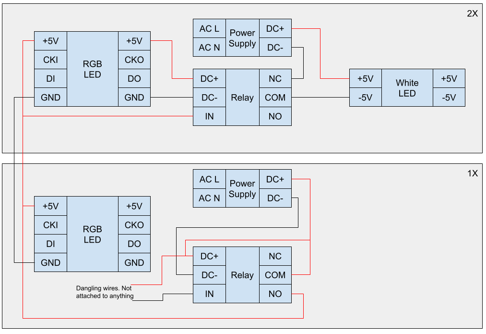

# LED Matrix

## Overview

### Components

- 2 gray power supplies [E339358](https://twobabox.com/an-overview-of-the-e339358-led-driver/)
- 3 single channel 5v [relays](https://microcontrollerslab.com/5v-single-channel-relay-module-pinout-working-interfacing-applications-datasheet/)
- RGB LEDs
    - LPD8806
- Micro Controller: Teensy 3.6
    - https://www.pjrc.com/teensy/td_download.html
    - https://www.pjrc.com/teensy/card9a_rev2_web.pdf

### Circuit Diagram

[Link](https://docs.google.com/drawings/d/1dMMITz0OXky1sPzoETWVAEU_hnqvFwCjvTqebHVzlCo/edit?usp=sharing)

### Software

- Makes use of the FastLED library.
    - Github repository [here](https://github.com/FastLED/FastLED).
    - Notes on HSV color maps [here](https://github.com/FastLED/FastLED/wiki/FastLED-HSV-Colors).
